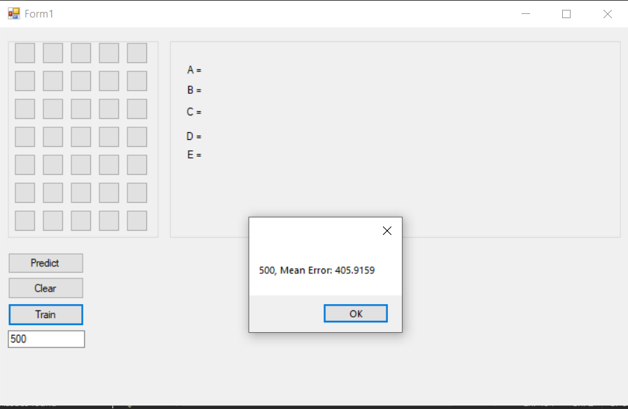

# Neural Network GUI Application

## Description
This project is a simple graphical user interface (GUI) application built using **C#** and **WinForms** that implements a basic feedforward neural network for recognizing binary patterns of letters (A, B, C, D, E) based on a 7x5 grid. The neural network is designed with one hidden layer and trained using predefined datasets.

The application allows users to:
- Draw binary patterns on a grid by toggling buttons.
- Train the neural network using predefined training sets.
- Predict the pattern drawn on the grid.
- Clear the grid for new input.

## Features

### 1. GUI Components
- **Grid (7x5):** Represents the input to the neural network. Each button can be toggled to create binary patterns.
- **Predict Button:** Feeds the current grid input to the neural network and displays the prediction for letters A, B, C, D, and E.
- **Train Button:** Trains the neural network using predefined datasets.
- **Clear Button:** Resets the grid and clears the predictions.
- **Epoch Input:** Allows the user to define the number of epochs for training.

### 2. Neural Network
- **Architecture:**
  - Input Layer: 35 neurons (corresponding to the 7x5 grid).
  - Hidden Layer: 16 neurons with ReLU activation.
  - Output Layer: 5 neurons with Tanh activation (representing A, B, C, D, E).
- **Training:** Implements backpropagation and gradient descent for updating weights.

### 3. Predefined Training Sets
The application includes three variations of training data for letters A, B, C, D, and E. Each training set represents different patterns of the same letters to improve the neural network's ability to generalize.

## Usage

1. **Training the Neural Network:**
   - Enter the number of epochs in the text box.
   - Click the **Train** button.
   - A message box will display the completion of training with the mean error.

2. **Making Predictions:**
   - Use the grid to draw a binary pattern (e.g., a letter).
   - Click the **Predict** button.
   - The predictions for A, B, C, D, and E will be displayed as values.

3. **Clearing the Grid:**
   - Click the **Clear** button to reset the grid and predictions.

## Screenshots
### Main Interface

## How It Works
1. **Input Grid:**
   - The 7x5 grid is converted into a flattened array of 35 inputs (0s and 1s) and fed into the neural network.

2. **Training:**
   - The neural network is trained using predefined training sets (3 variations) for each letter.
   - Training involves adjusting weights using backpropagation and gradient descent to minimize the error.

3. **Prediction:**
   - The trained neural network predicts the likelihood of each letter (A, B, C, D, E) based on the input grid.

## Future Improvements
- Add support for dynamic training data input by the user.
- Implement a save/load feature for neural network weights.
- Enhance the UI with better visualization for training progress and predictions.
- Introduce additional letters or custom patterns.
- Add performance metrics like accuracy and confusion matrix.

